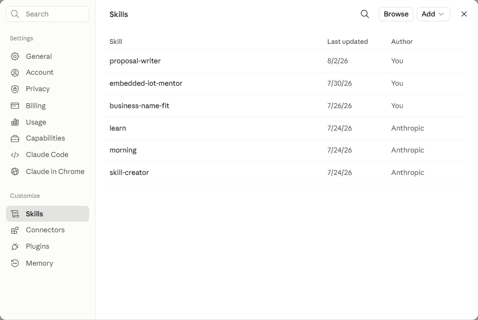
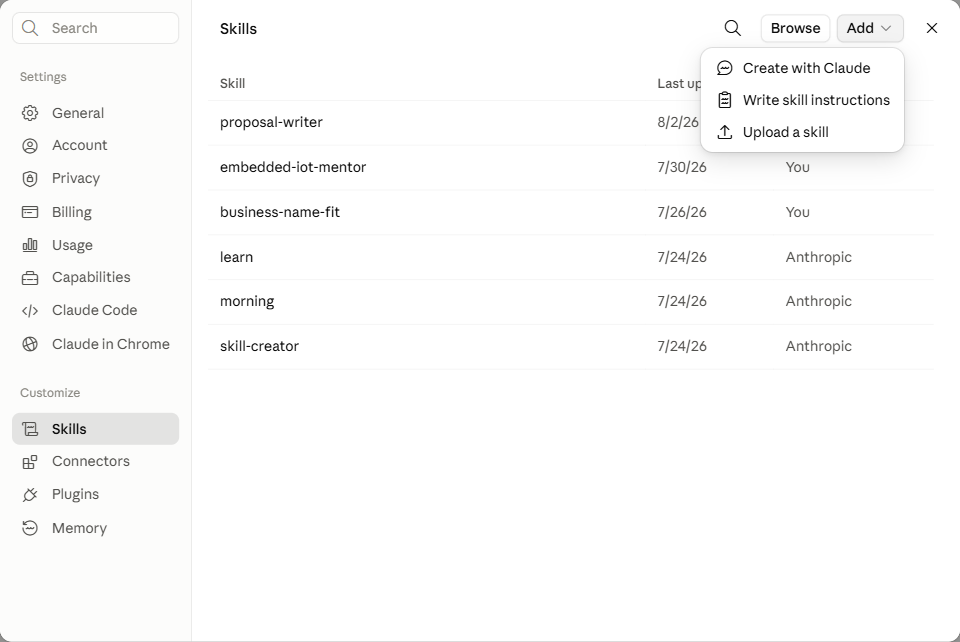
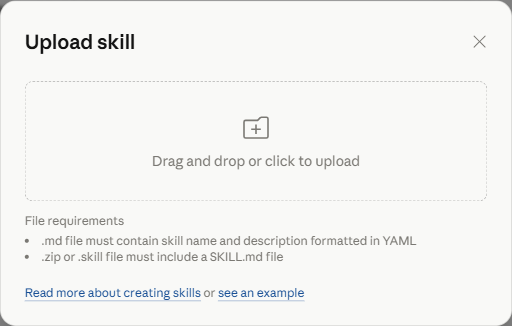

# Embedded / IoT Mentor — یک Skill برای Claude

[English](./README.md) · [Svenska](./README.sv.md) · **فارسی**

[](https://github.com/mh-mansouri/embedded-iot-mentor/actions/workflows/check-skill.yml)
[](https://github.com/mh-mansouri/embedded-iot-mentor/actions/workflows/check-links.yml)
[](https://github.com/mh-mansouri/embedded-iot-mentor/releases/latest)
[](./LICENSE)

<div dir="rtl" align="right">

یک Skill برای [Claude](https://claude.ai) که مثل یک مربی کارکشتهٔ سیستم‌های نهفته عمل
می‌کند: میکروکنترلر، برد و زنجیرهٔ ابزار پروژه‌تان را انتخاب می‌کند، هزینه و زمان لازم را
تخمین می‌زند، و نقشهٔ ساختی به دستتان می‌دهد که روی یک **بردبورد کارکننده** تمام می‌شود، نه
روی خط تولیدی که اصلاً سراغش را نگرفته‌اید.

بیشتر توصیه‌ها دربارهٔ سیستم‌های نهفته به یکی از دو طرف می‌لغزند: یا فهرست قطعات می‌دهند
بدون نقشه، یا برای کسی که هنوز یک LED را چشمک‌زن نکرده، نقشهٔ تولید انبوه می‌کشند. این Skill
اول می‌پرسد تا حالا واقعاً چه ساخته‌اید، بعد در همان سطح جواب می‌دهد.

## امتحانش کنید

| کجا | با یک کلیک |
|---|---|
| **Claude** | [فایل `embedded-iot-mentor.skill` را بگیرید](https://github.com/mh-mansouri/embedded-iot-mentor/releases/latest/download/embedded-iot-mentor.skill) و در Claude بازش کنید |
| **VS Code (Copilot Chat)** | پرامپت [`vscode-copilot/`](./vscode-copilot/) را کپی کنید — چیزی نصب نمی‌شود |
| **کد خودتان** | REST API را از کد خودتان صدا بزنید — [مسیرها](./api/) — [](https://render.com/deploy?repo=https://github.com/mh-mansouri/embedded-iot-mentor) |
| **هر چت هوش مصنوعی دیگر** | متن [`universal-prompt.md`](./universal-prompt.md) را به‌عنوان اولین پیام کپی کنید — بدون نصب، در ChatGPT، Gemini، Copilot و بقیه هم کار می‌کند |

صفحه را به چت ترجیح می‌دهید؟ [`docs/index.html`](./docs/index.html) یک صفحهٔ ثابت با همان
لینک‌های «امتحانش کنید» و دمو است — در آدرس https://iotmentor.dev در دسترس است، یا همین فایل
را مستقیماً دانلود و در مرورگر باز کنید، بدون نیاز به سرور.

جدول بالا مسیر سریع تری است؛ هر چیزی که بعد از این جدول قرار دارد، مسیری کندتراست که
توسط خودتان قابل انجام است.

## نمونهٔ اجرا

</div>


<div dir="rtl" align="right">

در این مثال تصویری از یک گوسفنددار در دِوون بریتانیا ارائه میشود که سابقه در کدنویسی نداره و میخواد با کمترین هزینه در شش نقطه از چراگاهش مقادیر رطوبت و نیتروژن خاک رو اندازه‌گیری و دورترین نقطه حدودا ۴۰۰ متر با خانه اش فاصله داره. این *skill* از همان اول نیمی از درخواست را رد می‌کند، چون هیچ پروب ارزانی نیتروژن خاک را صادقانه اندازه نمی‌گیرد، و بعد می‌گذارد در ادامه مسیر با انتخاب‌های خودش جلورود. وقتی کشاورز میگوید ۴۰۰ متر یعنی استفاده از ارتباطات رادیویی به‌جای Wi-Fi، و وقتی کشاورز میگوید «من تا حالا کد ننوشتم» یعنی فریمور آماده به‌جای زنجیرهٔ ابزار، و یک مرتع خیس یعنی نیاز به یک محفظهٔ مقاوم برای بورد. در اینجا بورد الکترونیکی آخرین چیزی است که تصمیمش گرفته می‌شود، نه اولین. متن کامل گفت‌وگو در[سناریوی D](./embedded-iot-mentor/examples/worked-examples.md#scenario-d--when-half-the-brief-cannot-be-built)
آمده است.

## چه کاری می‌کند

- **یک پلتفرم انتخاب می‌کند** — ESP32، Pico، STM32، nRF52 — و رک می‌گوید چرا همین یکی، به
  همراه یکی دو جایگزین و اینکه هرکدام کجا برنده می‌شوند.
- **مسیر سخت‌افزار را از مسیر فریمور جدا می‌کند**، تا بدانید چه باید بخرید و چه باید نصب
  کنید، بی‌آنکه این دو با هم قاطی شوند.
- **اصلاً بررسی می‌کند که لازم است فریمور بنویسید یا نه.** اگر ESPHome، Meshtastic یا Tasmota
  همین حالا کار را راه می‌اندازند، جواب همان است — نوشتن کد یک هزینه است، نه یک دستاورد.
- **داده را تا خودِ آدم می‌رساند** — Home Assistant، صفحه‌ای که خود دستگاه نشان می‌دهد، یک
  داشبورد آمادهٔ آنلاین، یا فقط یک هشدار. «روی گوشی‌ام» وقتی خانه‌اید با «روی گوشی‌ام» وقتی
  سر کارید دو ساخت متفاوت‌اند، و این را پیش از انتخاب به شما می‌گوید.
- **زمان و هزینه را به‌صورت بازه تخمین می‌زند** و می‌گوید واقعاً چه چیزی آن‌ها را بالا
  می‌برد — از جمله هزینهٔ *نگهداری و کارکرد*، وقتی پای شش گره در دل مزرعه در میان باشد که
  باتری می‌بلعند.
- **می‌گوید یک سنسور واقعاً چه چیزی را اندازه می‌گیرد.** پروب‌های ارزان «NPK» رسانایی را
  می‌خوانند و باقی را حدس می‌زنند؛ این را پیش از خریدن شش‌تا به شما می‌گوید، نه بعدش.
- **تا MVP نقشه می‌کشد و همان‌جا می‌ایستد.** مرحله‌های نمونهٔ مهندسی، پیش‌تولید و تولید هم
  هستند، اما فقط اگر بخواهید ارائه می‌شوند.
- **ریسک‌ها را نام می‌برد** — بودجهٔ توان، در دسترس بودن قطعات، نبود مسیر اشکال‌زدایی،
  گواهی‌نامه، و منحنی یادگیری همان چیزی که تازه پیشنهاد داده است.
- **پیشنهادهای خودش را با یک معیار ثابت رد می‌کند**: کتابخانهٔ نگهداری‌نشده، قطعهٔ
  تک‌تأمین‌کننده، بسته‌بندی‌ای که نمی‌شود لحیمش کرد، نبود کنسول سریال — گزینه را کنار
  می‌گذارد و از نو انتخاب می‌کند.

## چرا ساخته شده

خطاهایی که برای گرفتنشان ساخته شده است:

- **تازه‌کاری که به سمت STM32 و ST-Link هدایت می‌شود**، چون یک انجمن اینترنتی گفته
  «حرفه‌ای‌تر» است — سه شب صرف راه‌اندازی زنجیرهٔ ابزار می‌شود، پیش از آنکه اولین LED روشن
  شود.
- **پروژه‌ای باتری‌محور که حول یک برد توسعه طراحی شده**، بردی که رگولاتورش در حالت بی‌کاری
  ۲۰ میلی‌آمپر می‌کشد، پس آن عمر «دوماهه» در عمل چهار روز است. اشکال هیچ‌وقت از خود برد نبود؛
  کسی جریان خواب را حساب نکرده بود.
- **اولین PCB که با خازن و مقاومت ۰۴۰۲ و یک QFN سفارش داده می‌شود**، با هویه دستی مونتاژ
  می‌شود، و مرده به دست صاحبش می‌رسد، بی‌آنکه نقطهٔ تستی برای یافتن دلیلش وجود داشته باشد.
- **شش سنسوری که در جعبه‌های مخصوص فضای داخلی در مزرعه کار گذاشته می‌شوند**، با چسب‌نواری
  به‌جای گلند کابل آب‌بندی می‌شوند، و تا هفتهٔ دوم روی برد خودشان بخار می‌بندند.

## نصب

**گزینهٔ الف — یک فایل.** فایل `embedded-iot-mentor.skill` را از
[آخرین نسخهٔ منتشرشده](https://github.com/mh-mansouri/embedded-iot-mentor/releases/latest)
(یا [مستقیم از خود مخزن](./embedded-iot-mentor.skill)) دانلود کنید، سپس در [claude.ai](https://claude.ai):

1. روی نامتان در گوشهٔ پایین-چپ کلیک کنید، **Settings** را انتخاب کنید، و صفحهٔ **Skills** را زیر Customize باز کنید:

   

2. روی **Add** کلیک کنید، سپس **Upload a skill**:

   

3. فایل دانلودشدهٔ `embedded-iot-mentor.skill` را روی کادر آپلود بکشید (یا برای انتخاب کلیک کنید):

   

(ذخیرهٔ Skill باید برای حساب یا سازمانتان فعال باشد.)

**گزینهٔ ب — Claude Code.** آن را در پوشهٔ skills خودتان باز کنید:

</div>

```bash
python package_skill.py --install                                     # برای کاربر شما
python package_skill.py --install --skills-dir <repo>/.claude/skills  # فقط برای یک پروژه
```

<div dir="rtl" align="right">

یا اگر بستهٔ آماده را دارید و نسخه‌ای از این مخزن را ندارید:

</div>

```bash
python package_skill.py --install-from embedded-iot-mentor.skill
```

<div dir="rtl" align="right">

یا دستی — یک فایل `.skill` چیزی جز یک zip نیست:

</div>

```bash
mkdir -p ~/.claude/skills && unzip embedded-iot-mentor.skill -d ~/.claude/skills/
```

ویندوز: Expand-Archive جز پسوند .zip چیزی نمی‌پذیرد، پس اول از یک کپی نام‌گذاری‌شده استفاده کنید

```powershell
New-Item -ItemType Directory -Force "$HOME\.claude\skills" | Out-Null
Copy-Item embedded-iot-mentor.skill "$env:TEMP\embedded-iot-mentor.zip"
Expand-Archive "$env:TEMP\embedded-iot-mentor.zip" -DestinationPath "$HOME\.claude\skills" -Force
```

<div dir="rtl" align="right">

با این روشClaude Code  در نشست بعدی آن را پیدا می‌کند — `/skills` فهرستش می‌کند، و اگر گفت‌وگویی با
توضیحاتش بخواند، Claude  خودش هم بارگذاری‌اش می‌کند.

## چطور استفاده کنیم

کافی است پروژه را توصیف کنید. مثلاً:

> می‌خواهم رطوبت خاک را در یک گلخانه ثبت کنم و روی گوشی‌ام ببینم. چند تا اسکچ Arduino
> نوشته‌ام. بودجه شاید ۲۰ میلیون تومان، و دوست دارم ظرف یک ماه راه بیفتد.

یا

> برای یک سنسور باتری‌خور که باید یک سال با یک باتری سکه‌ای کار کند، کدام برد؟ قبلاً فریمور
> تحویل داده‌ام، پس ساده‌اش نکن.

یا

> یک ESP32 و یک BME280 در کشوی میزم دارم. با این‌ها ساختن چه چیزی می‌ارزد؟

یا همان نمونهٔ بالا:

> من کشاورزم و می‌خواهم رطوبت و نیتروژن خاک را در بخش‌های مختلف مرتعم اندازه بگیرم تا مطمئن
> شوم گوسفندهایم خوب تغذیه می‌شوند.

اگر هدف، سطح تجربه، منبع تغذیه، محیط یا زمان‌بندی هنوز روشن نباشد، چند سؤال کوتاه می‌پرسد —
و بعد به‌جای انشا، با جدول جواب می‌دهد. قرار است یک نقشهٔ کامل پروژه در یک صفحه جا شود؛ اگر
استدلال پشت یک انتخاب را می‌خواهید، بپرسید.

## جاهای دیگر: VS Code و REST API

این مربی قضاوتی است که نوشته شده، نه قابلیتی مخصوص Claude، پس قابل انتقال است. هر نسخه همان
رفتارهای مهم را نگه می‌دارد: اول MVP، جدا نگه داشتن سخت‌افزار از فریمور، ترجیح فریمور آماده
بر کدی که باید نوشته شود، معیار ثابت برای رد کردن یک قطعه، و کنار کشیدن در کارهای
ایمنی‌بحرانی، خودرو و حریم خصوصی.

| راه | چه کار می‌کنید | کِی می‌ارزد |
|---|---|---|
| [`vscode-copilot/`](./vscode-copilot/) | یک فایل را در `.github/copilot-instructions.md` کپی کنید، یا در Copilot Chat بچسبانید | در VS Code همیشه از همین‌جا شروع کنید — چیزی نصب نمی‌شود |
| [`api/`](./api/) | REST API را مستقر کنید — [با یک کلیک روی Render](https://render.com/deploy?repo=https://github.com/mh-mansouri/embedded-iot-mentor) — و از کد خودتان صدایش بزنید | تماس‌گیرنده یک اسکریپت یا سرویس است، نه آدمی پشت پنجرهٔ گفت‌وگو |

آنچه این دو با خود می‌برند فرق دارد. نسخهٔ Copilot فقط قضاوت است — نه فایل مرجعی دارد نه
اسکریپتی، پس برای عمر واقعی باتری یا جمع هزینهٔ قطعات هنوز باید سراغ خودِ Skill بروید. REST
API هر دو را مستقیم از پوشهٔ Skill می‌خواند، پس هیچ‌وقت از تغییری که اینجا داده شود عقب
نمی‌ماند.

## خوب است بدانید

- **قیمت‌ها و موجودی قطعات زود کهنه می‌شوند.** تخمین‌ها بازه‌اند، نه پیش‌فاکتور. پیش از
  سفارش، LCSC، Digi-Key یا تأمین‌کنندهٔ محلی خودتان را بررسی کنید.
- **قیمت‌های تومانی به نرخ ارز گره خورده‌اند.** قطعات دلاری قیمت‌گذاری می‌شوند؛ هر رقم
  تومانی در این متن با نرخ هر دلار ۲۰۰٬۰۰۰ تومان حساب شده و با تغییر نرخ، جابه‌جا می‌شود.
  اگر بودجه را به تومان می‌دهید، نرخ روز را هم بگویید تا تخمین‌ها با واقعیت بخوانند.
- **نمی‌تواند موجود بودن قطعه را در کشور شما تأیید کند**، و همین رایج‌ترین دلیلی است که یک
  نقشهٔ خوب زمین می‌ماند.
- **عمداً روی MVP متوقف می‌شود.** برای مرحله‌های بعدی صریح درخواست بدهید.
- **به درد کارهای ایمنی‌بحرانی نمی‌خورد.** در حوزهٔ پزشکی، خودرو یا سامانه‌های ایمنی تا
  مرحلهٔ نمونهٔ اولیه کمکتان می‌کند، و بعد رک می‌گوید توصیهٔ آماتوری کجا تمام می‌شود.

## ساختار مخزن

خودِ Skill در `embedded-iot-mentor/` قرار دارد. هرچه در ریشهٔ مخزن است، بسته‌بندی و
فراداده‌های پروژه است که Skill هیچ‌وقت سراغشان نمی‌رود.

| مسیر | چیست |
|---|---|
| `embedded-iot-mentor/SKILL.md` | دستورالعملی که Claude دنبال می‌کند. بیشتر تغییرها اینجا اعمال می‌شوند. |
| `embedded-iot-mentor/references/` | جزئیاتی که فقط با یک محرک خوانده می‌شوند: انتخاب MCU، ارتباطات، جایی که داده دیده می‌شود، تخمین هزینه، چک‌لیست PCB، توان و باتری، نصب در محیط واقعی، OTA، EMC، مرز ایمنی، منابع یادگیری. |
| `embedded-iot-mentor/scripts/` | ابزارهای کوچک و قطعی، که فقط وقتی عددی مشخص خواسته شود اجرا می‌شوند. |
| `embedded-iot-mentor/examples/` | سناریوهای کامل که *شکل* پاسخ را نشان می‌دهند، برای وقتی درخواست در قالب استاندارد نمی‌گنجد. |
| `embedded-iot-mentor.skill` | **تولیدشده.** یک zip از پوشهٔ بالا — دستی ویرایشش نکنید. |
| `package_skill.py` | بسته را می‌سازد، بررسی و نصب می‌کند. |
| `embedded-iot-mentor-demo.gif` | همان ضبطی که در بالا نشان داده شده. در بسته نیست — بسته‌ساز فقط پوشهٔ Skill را برمی‌دارد. |
| `universal-prompt.md` | همان مربی به‌شکل یک پرامپت کپی-پیست، برای هر چت هوش مصنوعی‌ای که Claude نیست. |
| `assets/install-steps/` | اسکرین‌شات‌های راهنمای آپلود Claude Skill، در بخش نصب بالا. |
| `docs/index.html` | صفحهٔ فرود ثابت برای GitHub Pages — همان لینک‌های «امتحانش کنید» و دمو، بدون نیاز به چت. |
| `create_skill_demo_gif.py` | یک GIF نمایشی (`assets/skill-demo-mockup.gif`) از یک سناریوی نوشته‌شده می‌سازد، برای وقتی ضبط واقعی در دسترس نیست. |
| `scripts/check_links.py` | بررسی می‌کند که همهٔ لینک‌های README، صفحهٔ فرود، `CONTRIBUTING.md` و فایل‌های توزیع هنوز کار می‌کنند. با `check-links.yml` در push، PR و هر هفته اجرا می‌شود. |
| `vscode-copilot/` | نسخهٔ Copilot — پرامپتی که کپی می‌کنید و چند نمونه پرسش. |
| `api/` | REST API — کتابخانهٔ مرجع را از پوشهٔ Skill می‌خواند و اسکریپت‌هایش را اجرا می‌کند. |
| `api/instructions.md` | قوانین مربی، فشرده‌شده به یک پرامپت مستقل، برای `POST /chat` و `GET /instructions`. اگر رفتاری را در `SKILL.md` تغییر دادید، همین‌جا هم منعکسش کنید. |
| `render.yaml` | نقشهٔ استقرار یک‌کلیکی API. برای اینکه Render پیدایش کند باید در ریشهٔ مخزن بماند. |
| `.github/DISTRIBUTION.md` | اینکه پروژه کجا فهرست شده و چطور فهرستش کنیم — قدم‌هایی که به‌جای یک workflow نیاز به ورود به حساب دارند. |

نگه داشتن Skill در پوشهٔ اختصاصی خودش مهم است: مشخصات فنی الزام می‌کند که `name` یک Skill با
نام پوشه‌اش یکی باشد، پس ساختن آن مستقیماً از ریشهٔ مخزن همان لحظه‌ای خراب می‌شد که کسی
مخزن را به شکل ZIP دانلود می‌کرد و `embedded-iot-mentor-main/` تحویل می‌گرفت.

## ساخت بسته

</div>

```bash
python package_skill.py          # -> ./embedded-iot-mentor.skill
python package_skill.py --check  # اعتبارسنجی منبع و بسته، بدون ساختن چیزی
```

<div dir="rtl" align="right">

فایل `.skill` یک آرشیو zip است که پوشهٔ Skill را در خود دارد — قالبش را
[مشخصات Agent Skills](https://agentskills.io/specification) تعریف می‌کند. بسته‌ساز هرچه را
زیر `embedded-iot-mentor/` باشد برمی‌دارد، پس یک فایل مرجع تازه بدون دست زدن به اسکریپت
ساخت، خودبه‌خود وارد بسته می‌شود. فایل‌های متنی با LF ذخیره می‌شوند و برچسب‌های زمانی zip
ثابت‌اند، پس بسته هر کس بسازد بایت‌به‌بایت یکسان درمی‌آید.

`--check` همان دروازه است، و CI روی هر push و pull request اجرایش می‌کند. وقتی شکست می‌خورد
که:

- frontmatter یکی از قیدهای مشخصات را بشکند (الگو/طول `name`، تطابق با نام پوشه، طول `description`);
- `SKILL.md` به فایلی در `references/…` یا `scripts/…` اشاره کند که وجود ندارد؛
- فایل `.skill` کامیت‌شده با پوشهٔ منبع نخواند.

مورد آخر مهم است، چون بسته در مخزن کامیت می‌شود: Skill را ویرایش کنید، بازسازی را فراموش
کنید، و آن‌وقت فایل دانلودی نسخه‌ای متفاوت از پوشهٔ منبع تحویل می‌دهد.

## اسکریپت‌ها

</div>

```bash
python embedded-iot-mentor/scripts/cost_estimator.py 1 4.50 "ESP32 DevKit" 10 0.12 "10k resistor"
python embedded-iot-mentor/scripts/footprint_hint.py 0603
python embedded-iot-mentor/scripts/sleep_budget.py --capacity 2000 --active-ma 80 \
    --active-ms 250 --sleep-ua 15 --interval-s 600
```

<div dir="rtl" align="right">

`sleep_budget.py` به‌جای جریان متوسط، ورودی‌های چرخهٔ کاری می‌گیرد، چون جریان متوسط دقیقاً
همان عددی است که هیچ‌کس از پیش نمی‌داند. همان فریمور، همان باتری، فقط جریان خواب از ۱۵
میکروآمپر به رگولاتور ۸ میلی‌آمپری یک برد توسعه تغییر کند: **۳٫۸ سال می‌شود ۸٫۳ روز.**

## سایر Skillهای مشابه

- **[Project Planning & Journaling](https://github.com/mh-mansouri/Project-Planning-Journaling)** —
  پیش از نوشتن کد، دامنهٔ پروژه را مشخص می‌کند و سپس یک مستند/ژورنال زنده و قابل‌ادامه
  با بازبینی دورهٔ هفتگی نگه می‌دارد.
- **[Business Name Fit](https://github.com/Elham-Farajnejad/business-name-fit)** —
  نامی برای کسب‌وکار/برند انتخاب یا بررسی می‌کند که هم به اصالت فرهنگی شما وفادار باشد
  و هم در بازارهایی که می‌فروشید خوب جا بیفتد.

## مشارکت

قدم تمامی توسعه دهنده ها و پیشنهادهایشان سرچشم و خوش‌آمدید — با تشکر از مشارکت شما، یکی از مهمترین بخش های نیازمند به مشارکت مربوط به توسعه و بهبود بخش های مرتبط با قطعات، تأمین‌کننده‌ها و اینکه در هنگام اجرای پروژه 
واقعاً چه چیزهایی خراب می‌شود است.
لطفا [CONTRIBUTING.md](CONTRIBUTING.md) را ببینید.

## مجوز

تحت [مجوز MIT](./LICENSE) منتشر شده — آزاد برای استفاده، هم‌رسانی و توسعه.

</div>
