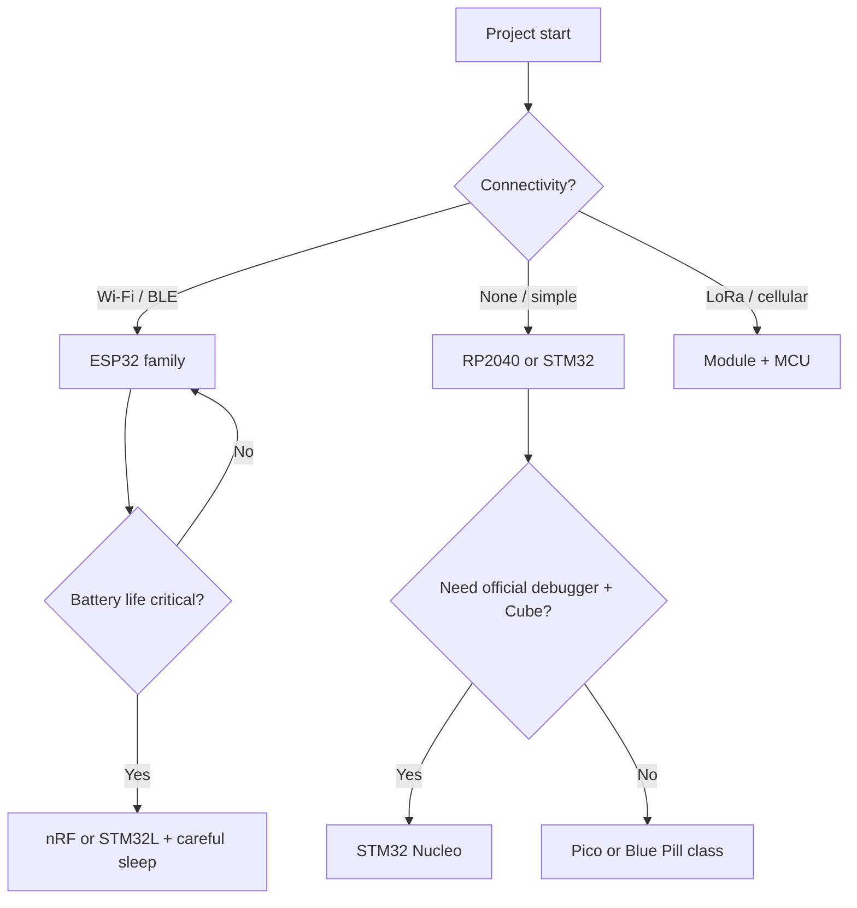

# MCU / Platform Selection Cheatsheet

Glanceable defaults. Prefer proven + well-supported.

| Need | Primary | Alternative 1 | Alternative 2 | Notes |
|------|---------|---------------|---------------|-------|
| Absolute beginner / fast PoC | ESP32 (DevKit) | Raspberry Pi Pico W | Arduino Nano / Uno | Wi-Fi+BLE on ESP32; Pico is simpler, cheaper |
| Battery + low power | nRF52840 / nRF54 | STM32L0/L4 (Nucleo) | ESP32-C3 (light sleep) | Check quiescent current |
| Rich peripherals / pro tools | STM32 (Nucleo-F4 or G0) | ESP32-S3 | RP2040 + PIO | ST-Link built-in on Nucleo |
| Tiny size / very low cost at volume | ESP32-C3 / C6 | STM32G0 | CH32V003 (RISC-V) | Start on known board first |
| Cellular / LoRa | ESP32 + modem module | nRF9160 | STM32 + LoRa module | Modules reduce RF pain |
| Audio / ML edge | ESP32-S3 | nRF5340 | STM32H7 | Check RAM + DSP needs |

## Quick decision forks

## Rules of thumb

- Start with a **development board** that has USB, regulator, and antenna (if RF). Never bare chip for MVP.
- MicroPython / CircuitPython only when the MCU has good support and the user prefers scripting.
- For volume >100, re-evaluate cost/package after the breadboard works.
- Avoid newest silicon unless a clear feature is required (supply risk).
